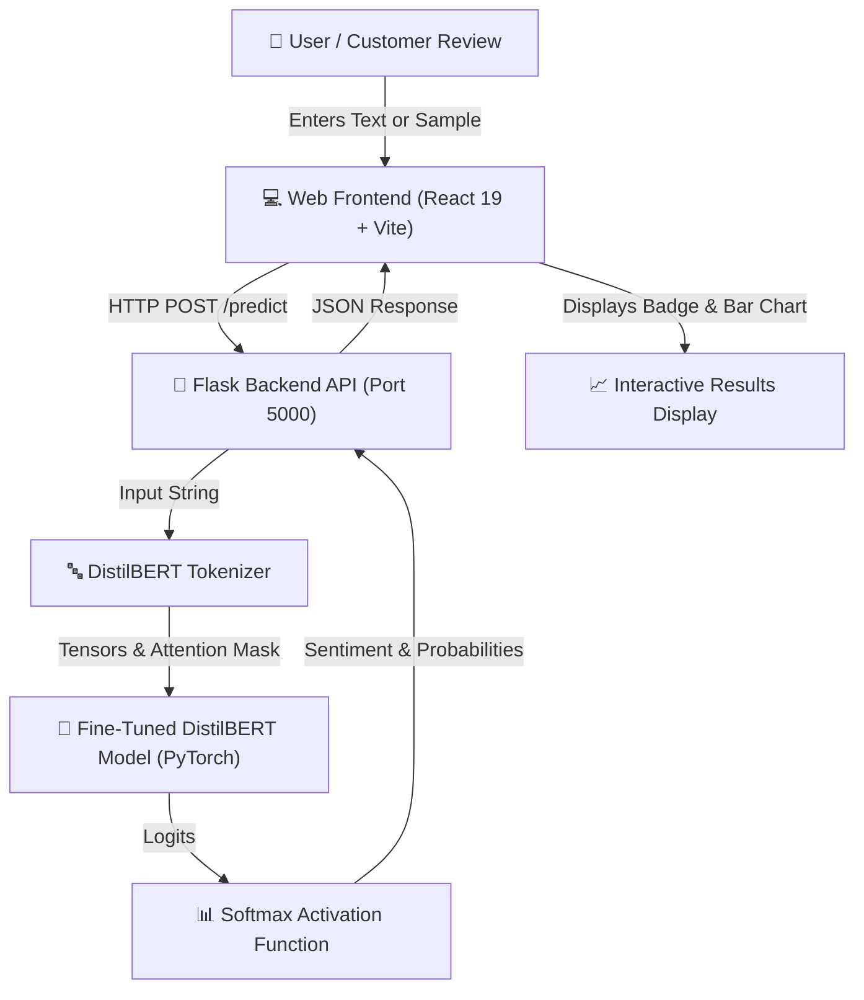

# 🎯 Customer Review Sentiment Analysis

[](https://www.python.org/)
[](https://pytorch.org/)
[](https://huggingface.co/)
[](https://flask.palletsprojects.com/)
[](https://react.dev/)
[](https://vitejs.dev/)
[](LICENSE)

An end-to-end full-stack Artificial Intelligence solution for **Customer Review Sentiment Analysis**. Powered by a fine-tuned **DistilBERT** Transformer model, a **Flask REST API** backend, and a modern **React + Vite** web interface.

---

## 🎯 Overview

Understanding customer feedback at scale is vital for business success. This application allows businesses and analysts to input raw customer reviews and receive real-time sentiment predictions (**Positive**, **Neutral**, or **Negative**) along with calibrated model confidence scores and class probability distributions.

---

## 📌 Problem Statement

Manual processing of thousands of customer reviews is slow, subjective, and prone to human error. Legacy rule-based or simple TF-IDF approaches miss contextual nuances like negation, sarcasm, and domain-specific vocabulary.

This project solves these challenges by utilizing deep contextual representations from fine-tuned **Transformers (DistilBERT)** to deliver fast, highly accurate, and automated sentiment inference.

---

## 📊 Dataset

The model is fine-tuned using a multi-class sentiment dataset of customer reviews:
- **Labels**:
  - `0`: **Negative**
  - `1`: **Neutral**
  - `2`: **Positive**
- **Preprocessing**: Cleaning, tokenization via `DistilBertTokenizer`, truncation, and padding (max sequence length: 128).
- Notebook workflow and experimentation details are documented in [`notebooks/mon_notebook.ipynb`](notebooks/mon_notebook.ipynb).

---

## 🤖 Transformer Model

- **Architecture**: `DistilBertForSequenceClassification`
- **Parameters**: ~66 Million parameters (lightweight, fast inference with 95%+ of BERT performance)
- **Layer Configuration**: 6 Transformer encoder blocks, 12 attention heads, hidden dimension of 768, GELU activation.
- **Artifacts**: Stored in `backend/saved_model/` using Hugging Face's `safetensors` format:
  - `config.json`
  - `model.safetensors`
  - `tokenizer.json`
  - `label_mapping.json`

---

## 🏗️ System Architecture



```text
Customer Review Text
       │
       ▼
Text Preprocessing & Tokenization (DistilBertTokenizer)
       │
       ▼
Transformer Inference (DistilBERT Sequence Classification)
       │
       ▼
Softmax Layer & Probability Distribution
       │
       ▼
Flask REST API (/predict Endpoint)
       │
       ▼
Web Frontend (React UI with Dynamic Visualizations)
```

---

## 🛠️ Technologies

### Machine Learning & NLP
- **Python 3.12+**
- **PyTorch**: Deep learning framework for model execution
- **Hugging Face `transformers`**: Model loading and sequence classification
- **NumPy**: Matrix operations and array handling

### Backend API
- **Flask**: Python microframework for REST API endpoints
- **Flask-CORS**: Cross-Origin Resource Sharing middleware for frontend integration

### Web Frontend
- **React 19**: Modern UI library with functional components & hooks
- **Vite**: Ultra-fast frontend build tool and dev server
- **CSS3**: Custom responsive styling with dynamic color badges and progress bars

---

## 📁 Project Structure

```text
customer-review-sentiment/
├── backend/
│   ├── app.py                   # Flask API entry point
│   ├── model.py                 # PyTorch model loader & inference engine
│   ├── requirements.txt         # Python dependencies
│   └── saved_model/             # Fine-tuned DistilBERT weights & tokenizer
│       ├── config.json
│       ├── label_mapping.json
│       ├── model.safetensors
│       └── tokenizer.json
├── frontend/
│   ├── index.html               # Main HTML entry
│   ├── package.json             # Frontend dependencies & scripts
│   ├── vite.config.js           # Vite server configuration
│   └── src/
│       ├── App.jsx              # Main React application component
│       ├── App.css              # Custom styling
│       └── main.jsx             # React DOM root renderer
├── notebooks/
│   └── mon_notebook.ipynb       # Model exploration & fine-tuning notebook
├── .gitignore                   # Ignored files (venv, node_modules, logs)
└── README.md                    # Project documentation
```

---

## ⚙️ Installation

### 1. Prerequisites
- **Python**: Version 3.10 or higher
- **Node.js**: Version 18 or higher (npm included)

### 2. Backend Setup
Navigate to the `backend` folder, create a virtual environment, and install the required packages:

```bash
# Navigate to backend
cd backend

# Create virtual environment (optional but recommended)
python -m venv venv

# Activate virtual environment
# On Windows (PowerShell):
.\venv\Scripts\Activate.ps1
# On Linux/macOS:
source venv/bin/activate

# Install dependencies
pip install -r requirements.txt
```

### 3. Frontend Setup
In a new terminal window, navigate to the `frontend` folder and install Node dependencies:

```bash
# Navigate to frontend
cd frontend

# Install dependencies
npm install
```

---

## 🚀 How to Run

### Step 1: Start the Backend API
In the `backend` directory (with virtualenv activated):

```bash
python app.py
```
*The API will start running at `http://127.0.0.1:5000`.*

### Step 2: Start the Web Frontend
In the `frontend` directory:

```bash
npm run dev
```
*The development server will launch at `http://localhost:5173`.*

---

## 📈 API Endpoint & Usage

### Endpoint: `POST /predict`

#### Request Header:
`Content-Type: application/json`

#### Request Body:
```json
{
  "text": "The product quality is absolutely amazing! Fast shipping too."
}
```

#### Response Example:
```json
{
  "sentiment": "Positive",
  "confidence": 0.9845,
  "probabilities": {
    "Negative": 0.0032,
    "Neutral": 0.0123,
    "Positive": 0.9845
  }
}
```

---

## 🖥️ Application Features

- ⚡ **Real-time Sentiment Prediction**: Instant feedback upon submitting review text.
- 🎯 **Quick Example Prompts**: Built-in sample buttons for testing Positive, Neutral, and Negative sentiments instantly.
- 🏷️ **Dynamic Sentiment Badges**: Color-coded output (Green for Positive, Orange for Neutral, Red for Negative).
- 📊 **Probability Bar Chart**: Visual breakdown showing percentage probabilities across all 3 sentiment categories.

---

## 🔮 Future Improvements

- [ ] **Batch Processing**: Support for bulk CSV file uploads and analysis export.
- [ ] **Multi-lingual Support**: Fine-tuning multilingual models (e.g., XLM-RoBERTa) for international reviews.
- [ ] **Dashboard Analytics**: Historical sentiment trend visualizations using Recharts or Chart.js.
- [ ] **Dockerization**: `docker-compose` setup for seamless single-command container deployment.

---

## 👩‍💻 Author

- **GitHub**: [@feryelifaoui](https://github.com/feryelifaoui)
- **Project**: Customer Review Sentiment Analysis
